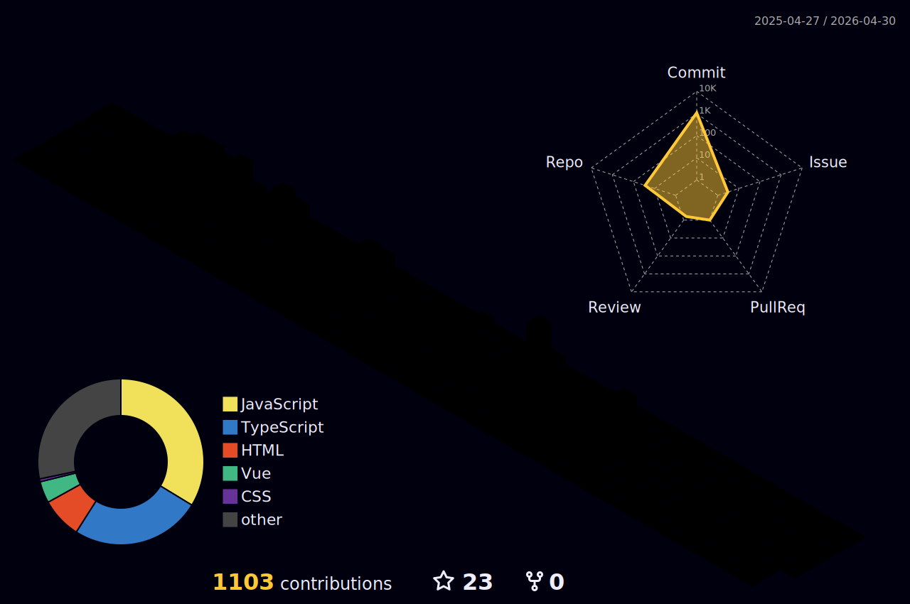

### Tech stack

### Tools I use

### Some projects

- 🧠 [vocabverse](https://github.com/zhenghaoyang24/vocabverse)：完整的单词记忆 Web 应用。 / Complete vocabulary memorization web application.
- ☑️ [you-todo](https://github.com/zhenghaoyang24/you-todo)：简洁易用的日程待办 Web 应用。 / A clean and user-friendly schedule and to-do web app.
- 📱 [blueblue-words](https://github.com/zhenghaoyang24/blueblue-words)：简易记单词小程序。 / A simple vocabulary memorization mini-program.
- ℹ️ [Front-Resource](https://github.com/zhenghaoyang24/Front-Resource)：收集前端开发的各类资源。 / Various resources for front-end development .
- 🎮 [webgames](https://github.com/zhenghaoyang24/webgames)：各种打开即可游玩的小游戏。 / Ready-to-play mini games of various types.
- 🏠 [reposhub](https://github.com/zhenghaoyang24/reposhub)：开源仓库集合，分类仓库。 / Open-source repository collection, categorized repositories.
- ✒️ [mdeditor](https://github.com/zhenghaoyang24/mdeditor)：极简的 markdown 在线编辑器。 / A minimalist online Markdown editor.
- 🌳 [filetree](https://github.com/zhenghaoyang24/filetree)：根据本地文件夹生成文件树。 / Generate a file tree based on a local directory.